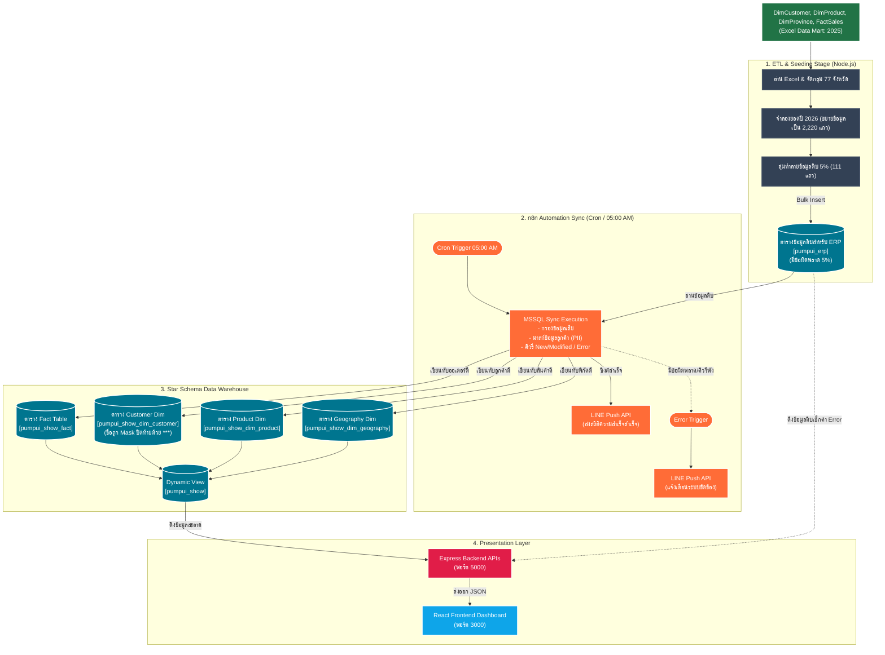
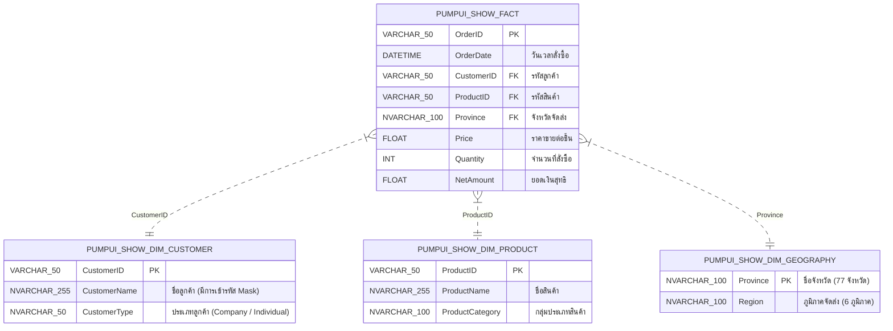
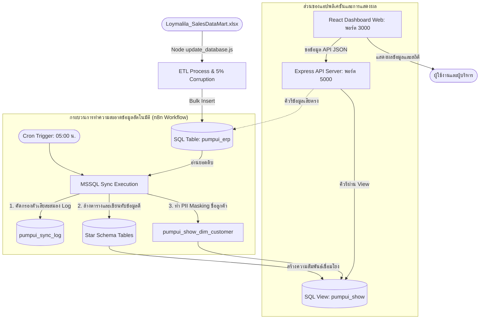
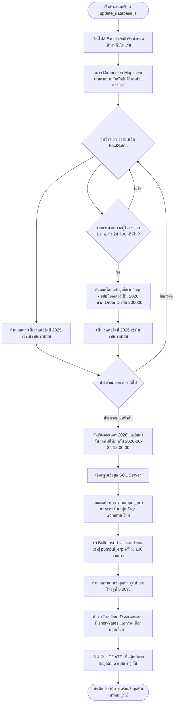

# รายงานสถาปัตยกรรมระบบ Loymalila Analytics & n8n Automation Sync
เอกสารฉบับนี้จัดทำขึ้นเพื่ออธิบายสถาปัตยกรรมการจัดการข้อมูล (Data Architecture) โครงสร้างฐานข้อมูล (Database Schema) เวิร์กโฟลว์การทำงานของ n8n และรายละเอียดคำอธิบายโค้ดทั้งหมดอย่างรอบด้านในระบบ **Loymalila Analytics**

---

## 1. ภาพรวมสถาปัตยกรรมระบบ (System Architecture Overview)

ระบบบริหารข้อมูลและการแสดงผล Loymalila Analytics ทำงานแบบแยกส่วน (Decoupled Architecture) แบ่งการทำงานออกเป็น 3 เลเยอร์หลัก:
1. **Data Ingestion & Simulation**: จำลองยอดขาย ERP และคุณภาพข้อมูลด้วย Node.js (`update_database.js`)
2. **Data Orchestration & Cleansing (n8n)**: ตรวจสอบความถูกต้อง ทำความสะอาดข้อมูล มาสก์ข้อมูลอ่อนไหว และแจ้งเตือนผลลัพธ์ผ่าน LINE API
3. **Application & Visualisation**: ให้บริการ APIs ข้อมูลด้วย Express และประมวลผลวาดกราฟและแผนที่ประเทศไทย 77 จังหวัดด้วย React (Vite)



---

## 2. โครงสร้างและการสร้างฐานข้อมูลอย่างละเอียด (Database Star Schema Modeling)

ฐานข้อมูลของระบบถูกออกแบบตามสถาปัตยกรรมคลังข้อมูล (Data Warehouse) แบบ **Star Schema** เพื่อแยกตารางข้อเท็จจริง (Fact Table) ออกจากตารางมิติมุมมอง (Dimension Tables) ซึ่งช่วยเพิ่มประสิทธิภาพในการทำคิวรีวิเคราะห์และการกรองข้อมูล



### 2.1 รายละเอียดการสร้างตาราง (DDL):
* **ตารางข้อเท็จจริง `pumpui_show_fact`**: เก็บค่าตัวเลข (Measures) เพื่อการคำนวณ โดยอ้างอิง Foreign Key ไปยังตารางมิติอื่นๆ:
  ```sql
  CREATE TABLE pumpui_show_fact (
      OrderID VARCHAR(50) NOT NULL PRIMARY KEY,
      OrderDate DATETIME NOT NULL,
      CustomerID VARCHAR(50) NOT NULL,
      ProductID VARCHAR(50) NOT NULL,
      Province NVARCHAR(100) NOT NULL,
      Price FLOAT NOT NULL,
      Quantity INT NOT NULL,
      NetAmount FLOAT NOT NULL,
      CONSTRAINT FK_ShowFact_Customer FOREIGN KEY (CustomerID) REFERENCES pumpui_show_dim_customer(CustomerID),
      CONSTRAINT FK_ShowFact_Product FOREIGN KEY (ProductID) REFERENCES pumpui_show_dim_product(ProductID),
      CONSTRAINT FK_ShowFact_Geography FOREIGN KEY (Province) REFERENCES pumpui_show_dim_geography(Province)
  );
  ```
* **ตารางมิติมุมมองลูกค้า (`pumpui_show_dim_customer`)**, สินค้า (`pumpui_show_dim_product`), และจังหวัดจัดส่ง (`pumpui_show_dim_geography`) เพื่อทำหน้าที่เป็นตาราง Lookup ข้อมูลในการ Join

---

## 3. รายละเอียดการทำงานของ n8n Workflow และระบบล้างข้อมูล (Cleansing Workflow Deep-Dive)

เวิร์กโฟลว์นี้ควบคุมรอบความถี่การซิงค์ข้อมูล การตรวจสอบความแตกต่างของข้อมูล (Change Data Detection) การล้างทำความสะอาด การทำหน้ากากข้อมูล PII และส่งการแจ้งเตือนกลับไปยังแอป LINE

### 3.1 การตรวจสอบเวลาประมวลผล (Schedule Trigger Node)
* **ชื่อโหนด**: `Cron Trigger 05:00 AM`
* **รายละเอียด**: เป็นตัวเริ่มการทำงานของรอบอัตโนมัติ โดยส่งสัญญาณคำสั่งทุกวันในเวลา **05:00 น.** (ตามการประมวลผลเวลาเซิร์ฟเวอร์เช้าตรู่)
* **พารามิเตอร์**: `cronExpression = 0 5 * * *`

### 3.2 กระบวนการทำงานของโหนดคำสั่ง `MSSQL Sync Execution`
เป็นส่วนประมวลผลของเวิร์กโฟลว์ โดยส่งสคริปต์ SQL ไปรันบนโฮสต์ฐานข้อมูลเพื่อดำเนินการล้างและแยกมิติดังนี้:

1. **ตรวจสอบความแตกต่างของออเดอร์ใน ERP เทียบกับข้อมูลเดิม (Modified Records Detection)**:
   ตรวจเช็กออเดอร์ที่มี OrderID เดียวกันในตารางดิบ `pumpui_erp` และตารางสะอาด `pumpui_show` แต่มียอดขายหรือจำนวนสินค้าไม่เท่ากันเพื่อบันทึกประวัติการแก้ไขข้อมูล:
   ```sql
   INSERT INTO @ModifiedDetails
   SELECT e.OrderID, e.CustomerName, e.ProductName, ...
   FROM pumpui_erp e
   INNER JOIN pumpui_show s ON s.OrderID = e.OrderID
   WHERE s.NetAmount <> e.NetAmount OR s.Quantity <> e.Quantity OR s.Price <> e.Price;
   ```
2. **การคัดกรองแถวข้อมูลผิดพลาดแบบไดนามิก**:
   คำนวณและดึงรายชื่อ OrderID ที่เสียหาย (Error Records) ใน `pumpui_erp` ออกมาเพื่อเก็บบันทึก และเลือกใบสั่งซื้อที่มีปัญหา 5 รายการแรกมาบันทึกรายละเอียดประวัติการซิงค์เพื่อสืบสวนย้อนกลับ:
   ```sql
   SELECT @error_count = COUNT(*) FROM @ErrorOrderIDs;
   SELECT TOP 5 OrderID FROM @ErrorOrderIDs ORDER BY OrderID;
   -- บันทึกสถิติและ OrderID ล่าสุดที่เสียลงในตาราง pumpui_sync_log คอลัมน์ errorDetails
   ```
3. **การล้างทำความสะอาดข้อมูล (Cleansing Logic)**:
   ระบบล้างข้อมูลเดิมใน Star Schema ทั้งหมด จากนั้นนำเข้าข้อมูลที่สมบูรณ์เท่านั้นตามเกณฑ์กรองความถูกต้อง:
   * **ห้ามเป็น Null**: `OrderID`, `OrderDate`, `CustomerID`, `ProductID`, `Price`, `Quantity`, `NetAmount`, `Region`, `Province`
   * **ห้ามติดลบ**: `Quantity >= 0`, `NetAmount >= 0`, `Price >= 0`
   * **ห้ามเป็นสตริงว่างเปล่า**: `Region <> ''`, `Province <> ''`
4. **กระบวนการปกป้องข้อมูลส่วนบุคคล (PII Masking Logic)**:
   หลังจากทำความสะอาดและนำข้อมูลเข้าสู่ Star Schema แล้ว ระบบจะแปลงชื่อลูกค้าที่เป็นข้อมูลสำคัญทางธุรกิจให้เป็นหน้ากากข้อความ โดยเก็บอักขระ 4 ตัวแรกไว้ และตามหลังด้วยเครื่องหมายดอกจัน 3 ตัว เพื่อลดความเสี่ยงด้านข้อมูลรั่วไหล:
   ```sql
   UPDATE pumpui_show_dim_customer
   SET CustomerName = LEFT(CustomerName, 4) + '***'
   WHERE CustomerName IS NOT NULL;
   ```

### 3.3 ระบบการส่งข้อความแจ้งเตือนผ่าน LINE API
เมื่อกระบวนการซิงค์รันเสร็จสิ้น เวิร์กโฟลว์ของ n8n จะส่ง JSON Payload ไปยัง LINE Messaging API เพื่อส่งการแจ้งเตือนความคืบหน้าเข้าสู่ LINE Bot ของผู้ดูแลระบบทันที:

* **โหนดแจ้งเตือนซิงค์ข้อมูลสำเร็จ (`LINE API (Success)`)**:
  * **Method**: `POST`
  * **API URL**: `https://api.line.me/v2/bot/message/push`
  * **ข้อความแจ้งเตือนสำเร็จ**:
    ```text
    ✅ สรุปการทำงาน Pumpui Dashboard
    
    ⏰ เวลา: {{ วันเวลาประมวลผลปัจจุบัน }}
    📊 จำนวนข้อมูลที่อัปเดต: {{$json.rowsInserted}} รายการ
    ❌ ข้อมูลที่ไม่สมบูรณ์: {{$json.rowsError}} รายการ
    🔍 ดูที่มีปัญหา: https://advanced-data-test.vercel.app/#sync
    🌐 แดชบอร์ด: https://advanced-data-test.vercel.app
    ```
* **โหนดจับข้อผิดพลาดกรณีระบบพัง (`Error Trigger` & `LINE API (Error)`)**:
  * หากการเชื่อมต่อฐานข้อมูลล้มเหลว หรือคิวรี SQL พัง โหนด `Error Trigger` จะตรวจพบและกระตุ้นโหนดส่งข้อความ LINE Alert ให้ผู้ดูแลระบบรับรู้เพื่อทำการแก้ไขด่วน:
    ```text
    ❌ เกิดข้อผิดพลาดในการซิงค์ข้อมูล!
    
    ⏰ เวลา: {{ วันเวลาเกิดความขัดข้อง }}
    ⚠️ สถานะ: ระบบทำงานไม่สำเร็จ
    📝 รายการที่ผิดพลาด: {{ ข้อความ Error จากระบบประมวลผล }}
    🌐 แดชบอร์ด: https://advanced-data-test.vercel.app
    ```

---

## 4. แผนภาพ Flowchart การทำงานของแต่ละส่วนในระบบ (Detailed Workflows)

### 4.1 เวิร์กโฟลว์ภาพรวมทั้งหมด (Overall System Flowchart)


---

### 4.2 เวิร์กโฟลว์การจำลองและนำเข้าข้อมูลดิบ (Data Seeding & Generation)


---

## 5. การวิเคราะห์ข้อมูลและการแสดงผลใน React Dashboard

* **การวาดแผนที่แบบ Dynamic Projection**:
  React Frontend โหลดรูปภาพเวกเตอร์แผนที่ประเทศไทยจาก GitHub raw JSON จากนั้นเมื่อมีการคลิกเลือกภูมิภาคบนแผนที่:
  1. ตัวกรองภูมิภาคจะค้นหารายชื่อจังหวัดในภาคนั้นๆ ออกมา
  2. ดึงค่าเงินสะสมของแต่ละจังหวัดมาสร้างชุดแถวข้อมูล
  3. สั่งคำนวณคำสั่งจัดเรียงแบบเรียงจากยอดขายมากไปหาน้อย (High-to-Low Sorted Array) และนำมาวาดกราฟิกบาร์ระบุค่าเงิน พร้อมกล่องตารางข้อแนะนำเชิงธุรกิจ
* **การตรวจจับ API ออฟไลน์ (Resilience)**:
  ระบบสืบค้นสัญญาณตอบกลับจาก Backend API ตลอดเวลา หากเกิดเหตุเชื่อมต่อไม่ได้จะแสดงสถานะ Offline และดึง Mock Data ทันทีเพื่อให้ระบบใช้งานต่อได้อย่างไร้รอยต่อ

---
> [!NOTE]
> เอกสารฉบับนี้อัปเดตสอดคล้องกับพารามิเตอร์การทำลายข้อมูลจริง **5%** และสถาปัตยกรรมการซิงค์ข้อมูลผ่านระบบ n8n ที่มีท่อส่ง LINE Alert และการปกป้อง PII Masking ในฐานข้อมูลปัจจุบันแล้วเรียบร้อย 
