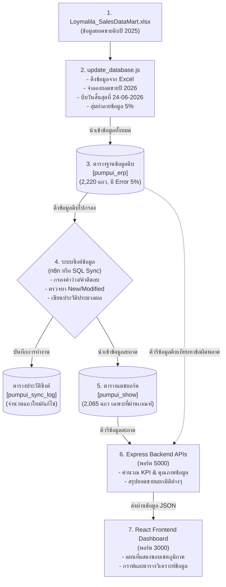

# เอกสารประกอบระบบแดชบอร์ดและการซิงค์ข้อมูล (Loymalila Analytics System)

เอกสารนี้อธิบายสถาปัตยกรรม การไหลของข้อมูล และรายละเอียดการทำงานของทุกส่วนประกอบในระบบอย่างละเอียด

---

## 1. ภาพรวมระบบ (System Overview)

ระบบวิเคราะห์ยอดขายและการจัดการข้อมูลของ **Loymalila (ลอยมะลิ)** เป็นระบบที่จำลองการดึงข้อมูลการสั่งซื้อจากระบบ ERP เข้าสู่ตารางข้อมูลดิบ (Raw Table) จากนั้นทำการวิเคราะห์ความถูกต้องของข้อมูล (Data Quality) ทำความสะอาดและตรวจจับการเปลี่ยนแปลงของข้อมูล (Change Data Detection) ก่อนจะซิงค์ข้อมูลที่ถูกต้องเข้าสู่ระบบแสดงผลแดชบอร์ดแบบเรียลไทม์

### เทคโนโลยีที่ใช้ (Tech Stack)
*   **Database**: Microsoft SQL Server (MSSQL Hosting)
*   **ETL & Data Control**: Node.js, library `xlsx` และ `mssql`
*   **Automation Sync**: n8n Workflow (หรือจำลองผ่าน Query ในสคริปต์)
*   **Backend Server**: Node.js Express
*   **Frontend Dashboard**: React (Vite) + Bootstrap + Chart.js

---

## 2. สถาปัตยกรรมการไหลของข้อมูล (Data Flow Architecture)

แผนภาพแสดงสตรีมการไหลของข้อมูลและการซิงค์ข้อมูลแบบ End-to-End:



---

## 3. โครงสร้างและรายละเอียดของฐานข้อมูล (Database Schema)

ระบบประกอบด้วยตารางหลัก 3 ตารางในฐานข้อมูล ดังนี้:

### 3.1 ตารางข้อมูลดิบ: `pumpui_erp`
ตารางนี้เปรียบเสมือนฐานข้อมูลหลักที่ได้รับรายการสั่งซื้อจากระบบขายหน้าร้านหรือระบบการผลิต ข้อมูลในตารางนี้จะยังไม่ผ่านการกรองข้อผิดพลาด มีโครงสร้างดังนี้:

| ชื่อคอลัมน์ (Column Name) | ประเภทข้อมูล (Data Type) | รายละเอียด |
| :--- | :--- | :--- |
| `OrderID` | `VARCHAR(50)` | รหัสรายการสั่งซื้อ (Primary Key จำลอง) |
| `OrderDate` | `DATETIME` | วันที่สั่งซื้อสินค้า |
| `CustomerID` | `VARCHAR(50)` | รหัสลูกค้า |
| `CustomerName` | `NVARCHAR(255)` | ชื่อลูกค้า |
| `CustomerType` | `NVARCHAR(50)` | ประเภทลูกค้า (`Individual` หรือ `Company`) |
| `ProductID` | `VARCHAR(50)` | รหัสสินค้า |
| `ProductName` | `NVARCHAR(255)` | ชื่อสินค้า |
| `ProductCategory` | `NVARCHAR(100)` | กลุ่มสินค้า (`ดอกไม้ไทย`, `ผลไม้สดชื่น` ฯลฯ) |
| `Price` | `FLOAT` | ราคาสินค้าต่อหน่วย |
| `Quantity` | `INT` | จำนวนสินค้าที่สั่งซื้อ |
| `NetAmount` | `FLOAT` | ยอดขายสุทธิรวมของรายการนั้น |
| `Province` | `NVARCHAR(100)` | จังหวัดที่จัดส่ง |
| `Region` | `NVARCHAR(100)` | ภูมิภาคที่จัดส่ง |

### 3.2 ตารางข้อมูลสะอาด: `pumpui_show`
มีโครงสร้างตาราง **เหมือนกับ `pumpui_erp` ทุกประการ** แต่จะเก็บเฉพาะแถวข้อมูลที่สมบูรณ์และถูกต้องเท่านั้น โดยจะถูกล้างค่าและนำเข้าใหม่ทุกครั้งที่มีการกดซิงค์ข้อมูล ข้อมูลในตารางนี้ใช้สำหรับทำแดชบอร์ดรายงานผลของบริษัท

### 3.3 ตารางประวัติการซิงค์: `pumpui_sync_log`
ใช้สำหรับเก็บบันทึกประวัติและสถิติในการประมวลผลข้อมูลรอบต่างๆ โครงสร้างมีดังนี้:
*   `SyncID` (`INT`, Auto Increment): รหัสประวัติการซิงค์
*   `SyncDate` (`DATETIME`): วันเวลาที่ซิงค์ข้อมูล
*   `NewRecords` (`INT`): จำนวนรายการใหม่ที่เพิ่มเข้าสู่คลังข้อมูล
*   `ModifiedRecords` (`INT`): จำนวนรายการเดิมที่มีการแก้ไขข้อมูลเงินหรือจำนวนสินค้า
*   `TotalRecords` (`INT`): ยอดสะสมแถวข้อมูลทั้งหมดในระบบ ERP ณ ตอนนั้น

---

## 4. กระบวนการจำลองข้อมูลและข้อผิดพลาด (`update_database.js`)

สคริปต์ [update_database.js](file:///d:/Advanced_Data/backend/update_database.js) เป็นสคริปต์หลักที่ดำเนินการเตรียมข้อมูลโดยทำหน้าที่แทนระบบ ETL ดังนี้:

### 4.1 การเตรียมและขยายข้อมูลเป็นปี 2569 (2026)
1.  **ดึงข้อมูลปี 2568 (2025) เดิม**: นำตาราง `FactSales` มาเชื่อมมิติต่างๆ ในเมมโมรีตามสเตจดั้งเดิม (สร้าง 1,500 รายการหลัก)
2.  **คำนวณและจำลองยอดขายปี 2569 (2026)**:
    *   วนซ้ำข้อมูลปี 2025 หากรายการสั่งซื้อนั้นมีวันเวลาระหว่างวันที่ **1 มกราคม ถึง 24 มิถุนายน** สคริปต์จะสร้างแถวใหม่ขึ้นมาอีก 1 แถวเพื่อเป็นข้อมูลปี 2026
    *   เปลี่ยนค่าปีของ `OrderDate` ให้เป็นปี **2026**
    *   ปรับรหัส `OrderID` โดยบวกด้วยค่า `200000` (เช่น 100001 เปลี่ยนเป็น 300001) เพื่อป้องกันไม่ให้รหัสซ้ำซ้อนกับข้อมูลปี 2025
    *   ข้อมูลที่ได้จะครอบคลุมยอดขายต่อเนื่องตั้งแต่ 01-01-2025 จนถึง 24-06-2026 (รวมเป็น 2,220 แถว)
3.  **บีบวันสิ้นสุดสูงสุด**: สคริปต์จะค้นหารายการปี 2026 ที่มีวันเวลาล่าสุด แล้วทำการเปลี่ยนวันเวลาของรายการนั้นให้เป็นวันที่ **24-06-2569 12:00:00** เสมอ เพื่อให้การคิวรี `MAX(OrderDate)` ได้ค่าตรงกับเป้าหมายพอดี

### 4.2 การสุ่มทำลายข้อมูล 5% (Data Corruption)
สคริปต์จะนำรายการข้อมูลทั้งหมดมาสับเปลี่ยนลำดับแบบสุ่ม (Fisher-Yates Shuffle) จากนั้นเลือกข้อมูลจำนวน **5%** (111 แถวจาก 2,220 แถว) เพื่อทำลายความถูกต้องของข้อมูลตามรูปแบบ 5 แบบเท่าๆ กัน:
1.  **ค่าลบ (Negative Values)**: ปรับจำนวนเป็น `-5` และ ยอดสุทธิเป็น `-150`
2.  **ยอดขายสุทธิว่าง (Null NetAmount)**: ตั้งค่า `NetAmount = NULL`
3.  **ที่อยู่ว่าง (Null Geography)**: ตั้งค่า `Region = NULL` และ `Province = NULL`
4.  **ที่อยู่ว่างเปล่า (Empty String Geography)**: ตั้งค่า `Region = ''` และ `Province = ''`
5.  **ความสัมพันธ์พัง (Null Dimension Link)**: ตั้งค่า `CustomerID = NULL` และ `ProductID = NULL`

---

## 5. กระบวนการประเมินและการซิงค์ข้อมูลทำความสะอาด

ขั้นตอนการซิงค์ข้อมูลถูกจำลองตามการทำงานของ **n8n Workflow** ดังนี้:

### 5.1 ตรวจจับรายการที่มีการแก้ไข (Modified Data Check)
ระบบจะตรวจเช็กข้อมูลระหว่างตารางดิบและตารางแสดงผลปัจจุบัน โดยค้นหาว่ามี `OrderID` ที่เหมือนกันแต่มีค่ายอดเงิน จำนวนสินค้า หรือราคา ไม่ตรงกันหรือไม่:
```sql
SELECT e.OrderID, e.CustomerName, e.ProductName, ...
FROM pumpui_erp e
INNER JOIN pumpui_show s ON s.OrderID = e.OrderID
WHERE s.NetAmount <> e.NetAmount OR s.Quantity <> e.Quantity OR s.Price <> e.Price
```

### 5.2 การกรองทำความสะอาด (Data Cleansing Filter)
เมื่อคำนวณและบันทึกประวัติลง `pumpui_sync_log` แล้ว ระบบจะทำการเคลียร์ข้อมูลเก่าในตารางแสดงผลลัพธ์ (`TRUNCATE TABLE pumpui_show`) จากนั้นเลือกเฉพาะแถวที่มีคุณสมบัติถูกต้องครบถ้วนจาก `pumpui_erp` กลับเข้าสู่ตาราง `pumpui_show` ตามข้อกำหนด:
*   `OrderID`, `OrderDate`, `CustomerID`, `ProductID` ต้องไม่เป็น `NULL`
*   `Price`, `Quantity`, `NetAmount` ต้องไม่เป็น `NULL` และต้องมีค่ามากกว่าหรือเท่ากับ `0`
*   `Region`, `Province` ต้องไม่เป็น `NULL` และต้องไม่เป็นสตริงว่าง `''`

---

## 6. โครงสร้างของ Backend APIs (`server.js`)

ตัวแอปพลิเคชัน Backend รันผ่าน Express และทำหน้าที่คิวรีข้อมูลจาก SQL Server เพื่อแปลงเป็น API รูปแบบ JSON:

*   **`GET /api/kpis`**:
    *   คิวรีข้อมูลทั่วไป เช่น ยอดขายรวม จำนวนสั่งซื้อ จำนวนสินค้า และจำนวนแถวของตาราง `pumpui_show`
    *   **การประเมินคุณภาพข้อมูลแบบไดนามิก**: ระบบจะคิวรีจำนวนแถวทั้งหมดในตารางดิบ `pumpui_erp` เพื่อนำมาเปรียบเทียบกับจำนวนแถวใน `pumpui_show` และคืนค่าคุณภาพออกมา เช่น หากมีข้อมูลดิบ 2,220 แถว ข้อมูลดีผ่านเกณฑ์ 2,065 แถว จะได้คะแนนคุณภาพข้อมูลเป็น `93.0%`
*   **`GET /api/sync-log`**: ดึงประวัติการซิงค์ข้อมูล 5 รอบล่าสุดมาแสดงบน แผงควบคุมระบบซิงค์
*   **`GET /api/sync-diff`**: ส่งรายการข้อมูลดิบที่รอการซิงค์ (Pending/Differences) แยกเป็นกลุ่มข้อมูลใหม่ และกลุ่มข้อมูลที่ตรวจพบการแก้ไข
*   **`GET /api/monthly-trends`**: วิเคราะห์ยอดขายรวมแบ่งเป็นรายเดือน (12 เดือน)
*   **`GET /api/region-sales`**: ยอดรวมยอดขายแบ่งตามภูมิภาคเพื่อนำไปใช้วาดสีบนแผนที่
*   **`GET /api/category-sales`**: ยอดรวมยอดขายแบ่งตามประเภทกลุ่มสินค้า
*   **`GET /api/top-analytics`**: สรุปรายชื่อลูกค้า 10 อันดับแรกที่มียอดซื้อสูงสุด และจังหวัด 10 อันดับแรกที่มียอดสั่งซื้อสูงสุด

---

## 7. ส่วนควบคุมและวาดผล Frontend (`App.jsx` & Thailand Map)

แอปพลิเคชันฝั่งผู้ใช้ถูกเขียนด้วย React ทำหน้าที่รับข้อมูลจาก Backend API มาประมวลผล:

*   **การเชื่อมต่อการจำลอง (Live Connection Check)**:
    *   แดชบอร์ดมีระบบตรวจจับสถานะเชื่อมต่อ Backend อัตโนมัติ หากติดต่อ Backend ได้สำเร็จ ไฟสถานะจะขึ้นเป็นสีเขียว `Live Server` และดึงข้อมูลจริงจากระบบ SQL Server มาวาดผล
    *   หากเกิดกรณีเซิร์ฟเวอร์ออฟไลน์ แดชบอร์ดจะปรับโหมดกลับไปเป็น `Offline Mock Data` อัตโนมัติเพื่อคงรูปหน้าเว็บไว้ไม่ให้เกิดการขัดข้องทางเทคนิค
*   **แผนที่แสดงขอบเขตภูมิภาคประเทศไทย (Thailand Regions Map)**:
    *   อ่านข้อมูลพิกัดภาพเวกเตอร์ (SVG Paths) ของจังหวัดต่างๆ ของประเทศไทยจากไฟล์ [thailand_regions.json](file:///d:/Advanced_Data/frontend/public/thailand_regions.json)
    *   แบ่งภูมิภาคออกเป็น 6 กลุ่มสีที่ชัดเจนและตัดกัน (เหนือ, ใต้, ตะวันออกเฉียงเหนือ, กลาง, ตะวันออก, ตะวันตก)
    *   มีการปรับแต่งความทึบแสง (Opacity) ของขอบเขตภาคเพื่อให้อ่านง่าย: เมื่อเน้นชี้เมาส์ที่ภาคใดภาคหนึ่ง ภาคที่ไม่ได้เลือกจะมีความทึบแสงอยู่ที่ `0.45` (จางลงเล็กน้อยแต่คงความคมชัดและสีดั้งเดิมไว้) และภาคที่ถูกเลือกจะมีความเข้มของสีเพิ่มขึ้นเป็น `0.95` พร้อมแสดงรายงานวิเคราะห์เชิงลึกของภูมิภาคนั้นๆ ที่แผงด้านข้าง
