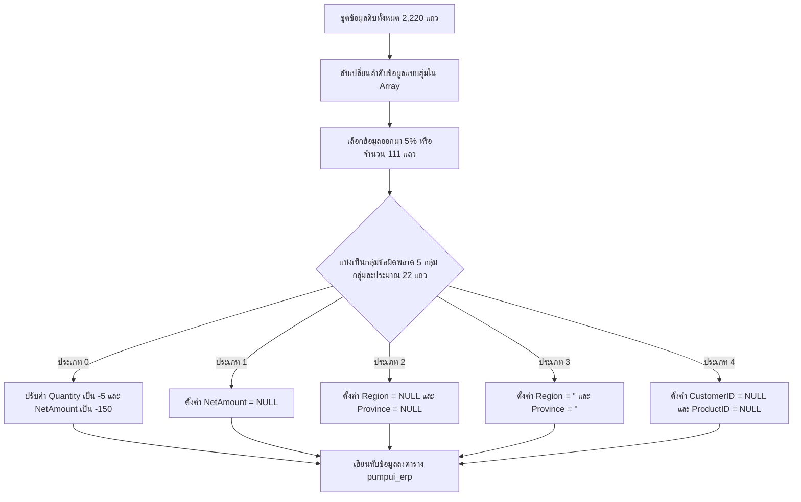
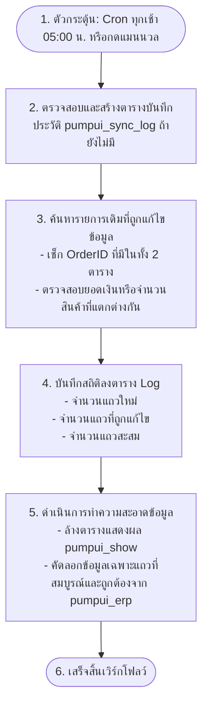
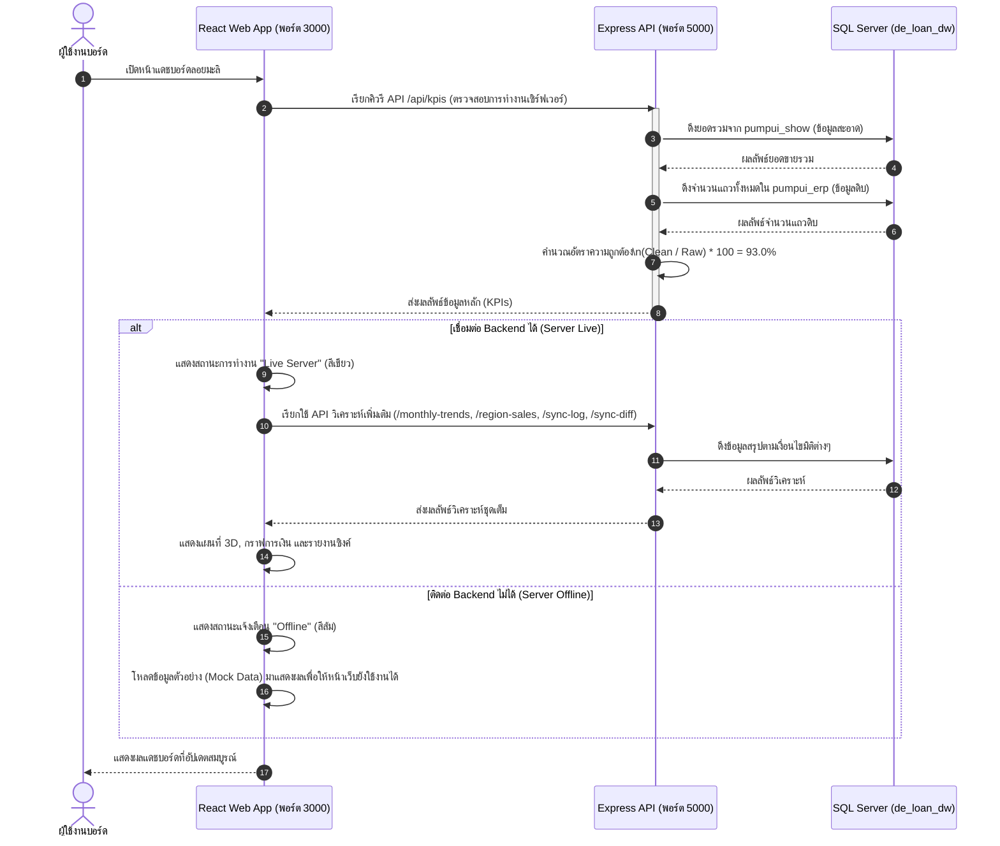

# คู่มืออธิบายเวิร์กโฟลว์การทำงานของระบบ (Loymalila System Workflows)

เอกสารฉบับนี้อธิบายลำดับสั้น-ยาว เวิร์กโฟลว์ (Workflows) ขั้นตอนการเปลี่ยนสถานะข้อมูล (Data State Transitions) และระบบนิเวศน์การประมวลผลข้อมูลในแต่ละสเตจอย่างละเอียด

---

## 1. เวิร์กโฟลว์การเตรียมข้อมูลและการแปลงข้อมูล (Data Generation & Loading Workflow)

สเตจนี้เป็นการจำลองระบบ ETL (Extract-Transform-Load) เพื่อดึงข้อมูลดิบจากไฟล์ Excel มาสร้างชุดข้อมูลรวมของปี 2025 และปี 2026 โดยมีวันสิ้นสุดข้อมูลที่แน่นอน

```mermaid
seqdiagram
    participant Excel as Excel Data Mart
    participant Script as update_database.js
    participant DB_Raw as MSSQL [pumpui_erp]
    
    Excel->>Script: 1. อ่านไฟล์ Excel (FactSales + ตารางมิติ)
    Script->>Script: 2. เชื่อมมิติ (Join Customer, Product, Region) ในเมมโมรี
    Script->>Script: 3. สร้างชุดข้อมูล 2025 เดิม (1,500 แถว)
    Script->>Script: 4. คัดลอกและขยับปีเป็น 2026 เคลื่อนไปจนถึงวันที่ 24-06-2026
    Script->>Script: 5. ปรับเปลี่ยน ID ให้เป็นรูปแบบใหม่ (SalesKey + 200000)
    Script->>Script: 6. บีบวันที่รายการล่าสุดเป็น 2026-06-24 12:00:00 พอดี
    Script->>DB_Raw: 7. ล้างตาราง และทำ Bulk Insert ข้อมูลทั้งหมด (2,220 แถว)
```

### รายละเอียดขั้นตอน:
1.  **อ่านไฟล์ดิบ**: ระบบอ่านไฟล์ `Loymalila_SalesDataMart.xlsx` ผ่าน Node.js
2.  **ประมวลผลเชิงความสัมพันธ์ (Dimension Mapping)**:
    *   แมป `CustomerKey` เป็นชื่อบริษัทและประเภทบริษัท
    *   แมป `ProductKey` เป็นชื่อและประเภทกลุ่มสินค้า
    *   แมป `ProvinceKey` เป็นชื่อจังหวัดและภาค
3.  **การขยายข้อมูลไปปี 2569 (2026)**:
    *   หากรายการข้อมูลในปี 2025 อยู่ในระหว่างวันที่ `01-01` ถึง `24-06` ระบบจะทำการโคลนข้อมูลขึ้นมาอีกหนึ่งแถว
    *   เปลี่ยนค่าปีของ `OrderDate` จาก 2025 เป็น 2026
    *   สร้างรหัสใบสั่งซื้อไม่ให้ทับซ้อนกัน โดยนำค่า `SalesKey` + `200000` (เช่น เลขออเดอร์ 100153 กลายเป็น 300153)
4.  **ล็อกค่าวันที่สูงสุด (Max Date Forcing)**: ค้นหาข้อมูลปี 2026 ที่มีวันที่ล่าสุด แล้วบังคับเปลี่ยนให้เป็นเวลา `2026-06-24 12:00:00` เพื่อให้ค่า Max Date บนแดชบอร์ดแสดงผลตรงกับวันที่ 24-06-2569
5.  **ลบและสร้างตารางใหม่**: เชื่อมต่อฐานข้อมูล MSSQL เพื่อทำการล้างและเขียนตาราง `pumpui_erp` และ `pumpui_show` ใหม่ จากนั้นนำเข้าข้อมูลดิบแบบ Batch ครั้งละ 100 แถว

---

## 2. เวิร์กโฟลว์การสุ่มทำลายข้อมูลดิบ (Data Quality Corruption Workflow)

สเตจนี้ทำงานต่อเนื่องหลังจากการนำข้อมูลดิบเข้าสู่ `pumpui_erp` เพื่อสุ่มสับเปลี่ยนและคัดแยกข้อมูลจำนวน **5%** มาจำลองสภาวะข้อมูลเสียหาย (Data Quality Errors)



### การควบคุมอัตราส่วนความผิดพลาด (Precision Control)
*   **คำนวณเป้าหมาย**: นำจำนวนแถวทั้งหมดคูณด้วย 0.07 และปัดเศษ (`Math.round(2220 * 0.07) = 155 แถว`)
*   **สับลำดับ (Shuffling)**: ใช้สัญกรณ์ Fisher-Yates ในการจัดเรียงลำดับ ID ใหม่ เพื่อให้มั่นใจว่าการเลือก 155 แถวที่จะเสียหายจะกระจายตัวอย่างทั่วถึง ไม่กระจุกตัวที่ปีใดปีหนึ่ง
*   **อัปเดตฐานข้อมูล**: ส่งคำสั่ง `UPDATE` ไปยังแถวที่ถูกเลือกเพื่อเปลี่ยนแปลงค่าความถูกต้องตามกลุ่มประเภทของ Error

---

## 3. เวิร์กโฟลว์การประมวลผลซิงค์ข้อมูลอัตโนมัติ (Sync & Cleansing Workflow - n8n)

เวิร์กโฟลว์ส่วนนี้จำลองการรันผ่านระบบ **n8n** เพื่อตรวจหาการเปลี่ยนแปลงและทำความสะอาดข้อมูลเพื่อนำส่งแดชบอร์ด



### หลักการทำความสะอาดข้อมูล (Cleansing Logic Rules):
ข้อมูลจากตารางดิบ `pumpui_erp` จะถูกส่งเข้าไปยังตาราง `pumpui_show` เฉพาะแถวที่ผ่านมาตรฐานคุณภาพข้อมูล (Data Quality Rule) ต่อไปนี้เท่านั้น:
1.  **ห้ามเป็นค่าว่าง (Not Null Constraint)**: รหัสใบสั่งซื้อ, วันที่สั่งซื้อ, รหัสลูกค้า, รหัสสินค้า, ราคา, จำนวน, ยอดขายสุทธิ, ภูมิภาค, และจังหวัด ต้องไม่เป็นค่า `NULL`
2.  **ห้ามเป็นสตริงว่าง (Not Empty Constraint)**: คอลัมน์ที่อยู่ภูมิภาคและจังหวัด ต้องไม่เป็นสตริงว่าง (`''`)
3.  **ค่าตัวเลขต้องไม่ติดลบ (Positive Value Constraint)**: ราคาขาย, จำนวนสินค้า, และยอดขายรวมสุทธิ ต้องมีค่าตั้งแต่ `0` ขึ้นไป

---

## 4. เวิร์กโฟลว์ระบบ Backend API และแดชบอร์ดแสดงผล (API & Render Workflow)

การเชื่อมโยงข้อมูลระหว่างผู้ใช้ แดชบอร์ด และฐานข้อมูล โดยมีขั้นตอนร้องขอและการแสดงผลแบบสองขั้นตอน (Two-Phase Verification)



### การคำนวณ KPIs แดชบอร์ด:
*   **ยอดขายรวม (Revenue)**: ดึงมาจากผลรวมยอดเงิน (`SUM(NetAmount)`) ของตาราง `pumpui_show` (แสดงผลเฉพาะรายการที่ผ่านเกณฑ์ถูกต้อง)
*   **อัตราความผิดพลาดข้อมูล (Data Quality Score)**:
    $$\text{Data Quality Score} = \frac{\text{แถวที่ถูกต้องผ่านเกณฑ์ (pumpui\_show)}}{\text{แถวดิบในระบบ ERP ทั้งหมด (pumpui\_erp)}} \times 100\% = \frac{2,065}{2,220} \times 100\% = 93.0\%$$
    คะแนนนี้ทำให้ผู้บริหารเห็นทันทีว่า ปัจจุบันมีข้อมูลที่ป้อนผิดพลาดอยู่ในระบบ ERP อยู่ถึง **7.0%** (100% - 93%) ซึ่งต้องเข้ากระบวนการกรองก่อนนำมาวิเคราะห์ยอดขาย
